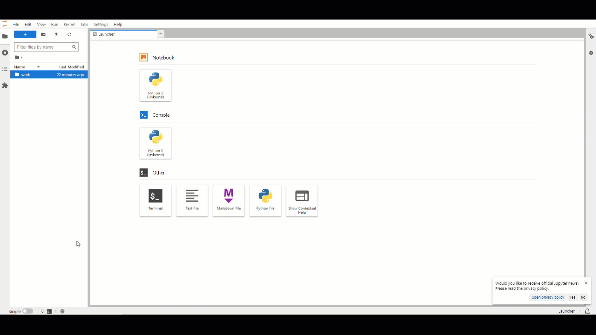

# Local Spark Cluster Repository

## Purpose

This repository contains a Docker-based setup for a Spark cluster to run Pyspark scripts.

It offers a containerized Spark environment that allows users to run small Spark scripts locally for testing and verification purposes.


## Repository Structure

```bash
local-spark-cluster/
 ├── src/                 # Source code for Python scripts
 │ ├── init.py 
 │ ├── spark_session.py   # Script to initialize Spark session
 │ └── scripts/           # Directory for user scripts 
 │  ├── init.py 
 │  ├── script1.py        # Example Python script 1 
 │  └── script2.py        # Example Python script 2 
 ├── data/                # Output data storage 
 │  └── input/
 │  └── output/
 ├── .gitignore
 ├── docker-compose.yaml  # Docker configuration
 ├── README.md            # Project documentation
 └── spark_cluster.sh     # Bash script to manage spark cluster
```

## Prerequisites

- **[Docker](https://docs.docker.com/get-docker/)** and **[Docker Compose](https://docs.docker.com/compose/install/)** installed on your machine.
- Basic understanding of **[Apache Spark](https://spark.apache.org/)** and **[Python](https://www.python.org/)**.

## Using the [spark_cluster.sh](spark_cluster.sh) Script

The spark_cluster.sh script provides various commands to manage the Spark cluster. 

Here after the available actions:

- `deploy`: Starts the Spark cluster. 
    - `--no-jupyter` disable Jupyter notebook deployment
    - `--scale=<number>` set the number of worker. *Default to 1*
    - `--mem=<memory>` set the memory per worker. *Default to 1*
    - `--cores=<cores>` set the number of cores per worker. *Default to 1*

    *Example:*
    ```bash
    ./spark_cluster.sh deploy --no-jupyter --scale=2 --mem=3 --cores=2
    ```

- `stop`: Stops all running containers in the Spark cluster.

    *Example:*
    ```bash
    ./spark_cluster.sh stop
    ```

- `status`: Displays the status of the Spark cluster, showing which containers are running.

    *Example:*
    ```bash
    ./spark_cluster.sh status
    ```

- `run <script>`: Executes a specified PySpark script.

    *Example:*
    ```bash
    ./spark_cluster.sh run script1.py
    ```

## How To Use It

### **Launching the Spark Cluster**

#### 1. **Navigate to the root directory of the repository**:

```bash
cd path/to/your_local_repository
```

---

*⚠️ Make sure to replace `path/to/your_local_repository` with your local repository path*

#### 2. **Start Docker containers:**

You can start the Docker containers using the provided deployment scripts:

```bash
./spark_cluster.sh deploy
```

#### 3. **Check the status of your containers:**

```bash
./spark_cluster.sh status
```

---

✅If everything is working correctly, you should see the list of your running containers, showing the name, state (e.g., Up), and ports for each service.

*For example:*

```bash
Name                              Command               State           Ports                  
-----------------------------------------------------------------------------------------------
spark-cluster-spark-master_1      /opt/bitnami/scripts/  Up              0.0.0.0:8080->8080/tcp
spark-cluster-spark-worker-1      /opt/bitnami/scripts/  Up                                    
```

This means that both the Spark master and worker nodes are running as expected and are accessible on their respective ports.

---

❌ If there are any issues, the `State` column might show `Exited` or `Restarting`, indicating that one or more containers have failed to start or are repeatedly restarting.

*For example:*

```bash
Name                              Command               State           Ports                  
-----------------------------------------------------------------------------------------------
spark-cluster-spark-master_1      /opt/bitnami/scripts/  Exited         0.0.0.0:8080->8080/tcp
spark-cluster-spark-worker-1      /opt/bitnami/scripts/  Up                                    
```

## **Creating PySpark Scripts**

You can create and run your own PySpark scripts by placing them in the [./src/scripts/](./src/scripts/) folder.

To do so, follow the process outlined below.


#### 1. **Importing the Spark Session:**

To initialize a Spark session, import the `get_spark_session` function from the `spark_session` module:
- In the `get_spark_session` function, you need to provide a unique name for your Spark application.
- This name will identify the application in the Spark UI and will also be used to define the input and output paths. 

```python
from spark_session import get_spark_session

# Get the spark session and specify a name for your spark application
spark_session = get_spark_session("YourSparkApplicationName")
```

#### 3. **Input Data**

Place your input files in [./data/input/YourSparkApplicationName](./data/input).

To use your inputs, utilize the `read_dataframe` function, which extends the Spark DataFrame functionality:
- This function read files from the [data/input](./data/input/) folder 
- This function automatically determines the file format based on the file extension.
- Additionally, you can pass various Spark read options through `**kwargs` to customize the reading process.

Supported input file formats:

- **CSV**
- **Parquet**
- **JSON**

Example:
```python
# Example usage of read_dataframe function
df = spark_session.read_dataframe(
    "YourSparkApplicationName/data.csv",  # Specify the input file with its path
    header=True,                          # Example of a Spark read option
    inferSchema=True,                     # Another Spark read option
)
```

---

*⚠️ Replace `YourSparkApplicationName` with the name you used when initializing the Spark session.*

---

#### 2. **Writing your Spark logic**

After initializing the Spark session, you can write your Spark logic as needed, such as reading data, performing transformations, analyzing datasets etc...

#### 3. **Writing output data**

To write your DataFrame output, use the `write_dataframe` function, which extends the Spark DataFrame functionality:
- The output will be saved to [./data/output/YourSparkApplicationName](./data/input):


You can write the output in fthe following format:
- `csv`
- `parquet`
- `json`

 Exemple:
 ```python
 # Example usage of write_dataframe function
 df.write_dataframe(format="csv")
 ```

#### 5. **Script Template**

If you're unsure how to structure your script, a template is available at [./src/scripts/script_template.py](./src/scripts/script_template.py)

This template includes the basic setup for initializing a Spark session, reading input data, processing data and writing an output dataset.

## **Executing Python Scripts**

You can run your spark scripts using the provided deployment scripts:

```bash
./spark_cluster.sh run <script1.py>
```

---

*⚠️ Make sure to replace `script1.py` with the name of your script.*

*Scripts are located in the `/home/spark/src/scripts/` directory within the container*

---

## Using Jupyter Notebook

By default, Jupyter will be enabled. To disable Jupyter Notebook you should use the --no-jupyter flag when deploying the cluster.

After starting the cluster, you can access Jupyter Notebook by navigating to: http://localhost:8888




## **Spark Interfaces**

### **1. Accessing the Spark UI**
You can access the Spark Master web UI to monitor your cluster and jobs by navigating to: [http://localhost:8080](http://localhost:8080).

This UI provides an overview of the Spark cluster, including the status of jobs, executors, and other resources.

---

*For more details, refer to the official documentation: [Spark Monitoring and Instrumentation](https://spark.apache.org/docs/latest/monitoring.html)*

### **2. Accessing Spark History Server**
To view the history of completed Spark applications, you can access the Spark History Server at: [http://localhost:18080](http://localhost:18080).

This interface allows you to review the details of past Spark jobs, including execution times and resource usage.

---
*For more details, refer to the official documentation: [Spark History Server](https://spark.apache.org/docs/latest/monitoring.html#viewing-after-the-fact)*


## **Stopping the Spark Cluster**

When you are finished using the Spark cluster, you can stop all running containers.

You can stop hte PSark Cluster using either the provided deployment scripts:

```bash
./spark_cluster.sh stop
```

## **Conclusion**

This repository provides a Spark environment to run small PySpark scripts.

Feel free to add scripts in the [/src/scripts/](./src/scripts/) directory as needed for your data processing needs.

For any questions or issues, please refer to the following resources:
- [Apache Spark Documentation](https://spark.apache.org/docs/latest/)
- [Docker Documentation](https://docs.docker.com/)
- [Bitnami Spark Docker Documentation](https://github.com/bitnami/bitnami-docker-spark)
- [PySpark Documentation](https://spark.apache.org/docs/latest/api/python/)

---

*For further assistance, feel free to contact me directly at [mathieu.masson@alten.com](mailto:mathieu.masson@alten.com).*

